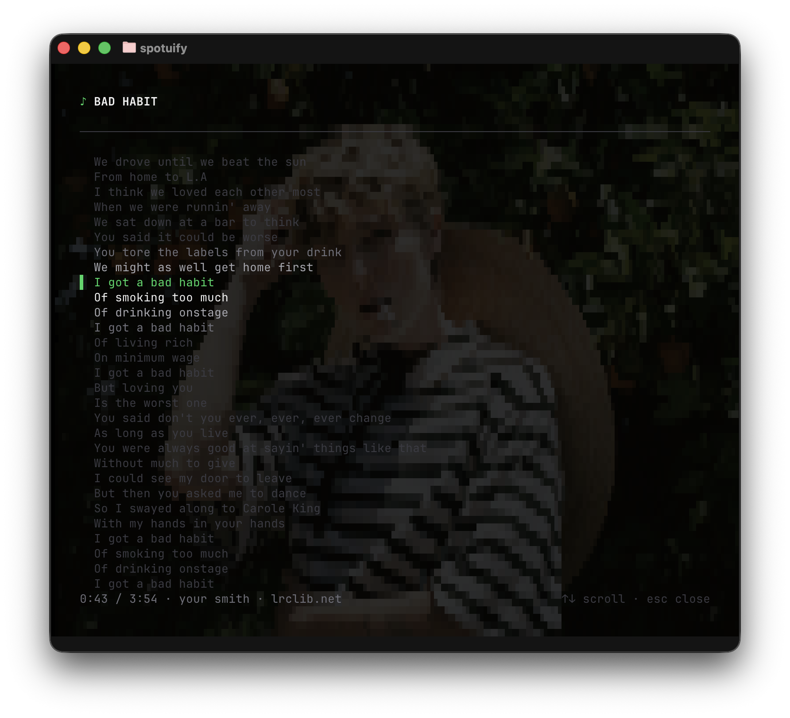

<p align="center">
  
</p>

<p align="center">🕺 spotify in ur terminal</p>

<p align="center">
  Play, browse, and control Spotify from your terminal, with an interactive TUI and a scriptable CLI.
</p>

<p align="center">
  <a href="https://bun.sh"></a>
  <a href="https://www.rust-lang.org"></a>
  <a href="https://opentui.com"></a>
  <a href="https://github.com/librespot-org/librespot"></a>
</p>

<p align="center">
  
  
</p>

## Install

### Standalone

macOS / Linux:

```sh
curl -fsSL https://crapshack.net/spotuify/install.sh | sh
```

Windows:

```powershell
irm https://crapshack.net/spotuify/install.ps1 | iex
```

### npm (macOS, Linux, Windows)

```sh
npm install -g spotuify          # stable
npm install -g spotuify@canary   # canary
```

### Homebrew (macOS, Linux)

```sh
brew install austin-smith/tap/spotuify
```

### Direct download

macOS, Linux, and Windows builds are available from
[GitHub Releases](https://github.com/austin-smith/spotuify/releases).

## Update

```sh
# Install the latest available version
spotuify update

# Check for an available update without installing it
spotuify update --check
```

Spotuify delegates npm and Homebrew updates to their package managers. Installer-managed standalone
installations update transactionally in place. Manually extracted direct downloads remain unmanaged
and must be replaced from [GitHub Releases](https://github.com/austin-smith/spotuify/releases).

## First-time setup

Requirements:

- A [Spotify Developer](https://developer.spotify.com/dashboard) app (`spotuify auth` walks through creating one)
- A [Spotify Premium](https://www.spotify.com/premium/) subscription (required for playback)

Run the guided setup:

```sh
spotuify auth
```

To check the setup:

```sh
spotuify doctor
```

## TUI

Launch the interactive player:

```sh
spotuify
```

Press `?` in the player for the full keymap.

## CLI

Use the CLI to control playback, search the catalog, manage your library, playlists, and followed
artists, view and add to the queue, and switch devices. For scripts, add `--json` to get
machine-readable output.

Some examples:

```sh
spotuify status
spotuify play
spotuify search "laura marling"
spotuify playlist list
spotuify queue list
spotuify device list
spotuify status --json
```

Run `spotuify --help` for all commands and options. See the [CLI guide](docs/cli.md) for scripting,
output formats, exit codes, and the playback service.

## MCP server

AI agents can search Spotify and control playback through the built-in
MCP server. Register `spotuify mcp` as a stdio server in any MCP client:

```sh
claude mcp add spotuify -- spotuify mcp   # Claude Code
codex mcp add spotuify -- spotuify mcp    # Codex CLI
```

Clients that use the common `mcpServers` JSON convention (e.g., Cursor):

```json
{
  "mcpServers": {
    "spotuify": {
      "command": "spotuify",
      "args": ["mcp"]
    }
  }
}
```

See the [MCP guide](docs/mcp.md) for the tool list and other client configurations.

## Development

Running from source requires [Bun](https://bun.sh) and [Rust](https://rustup.rs/).

On Linux, install the native build dependencies:

- Debian/Ubuntu: `sudo apt install build-essential pkg-config libasound2-dev`
- Arch: `sudo pacman -S --needed base-devel alsa-lib`

```sh
bun install
bun run auth          # build and authorize both Spotify sessions
bun run dev           # run the TUI
bun test              # unit tests
bun run typecheck     # TypeScript
bun run engine:test   # native engine tests
```

## Architecture

Spotuify uses two independent Spotify sessions:

- The Web API uses Authorization Code + PKCE with your registered Spotify app.
- Terminal playback uses [librespot](https://github.com/librespot-org/librespot)'s own login and a
  native Rust sidecar.

The Web API token is never passed to librespot. For terminal playback, the TUI sends commands to
the sidecar and treats its local player events as authoritative. The app uses the Web API for browsing and
remote-device control, and the TUI periodically reconciles playback state against it.
