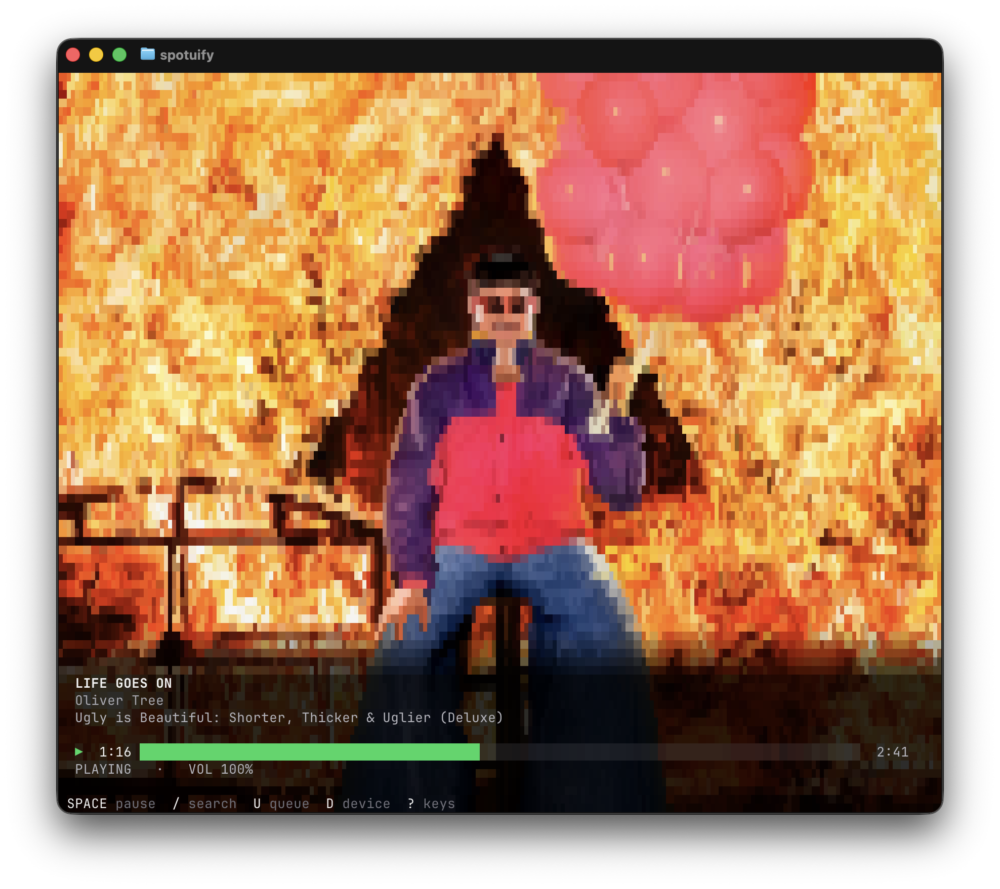

<h1 align="center">spotuify</h1>

<p align="center">🕺 spotify in ur terminal</p>

<p align="center">
  <a href="https://bun.sh"></a>
  <a href="https://react.dev"></a>
  <a href="https://opentui.com"></a>
  <a href="https://github.com/librespot-org/librespot"></a>
</p>

<p align="center">
  
</p>

## Setup

> **Warning**
>
> spotuify streams audio through [librespot](https://github.com/librespot-org/librespot) and
> requires Spotify Premium. Running from source requires Bun 1.3, the stable Rust toolchain, and
> the standalone librespot CLI:
>
> - macOS: `brew install librespot`
> - Most everything else: `cargo install librespot`

### 1. Register a Spotify app

Create one at <https://developer.spotify.com/dashboard> and add exactly this redirect URI — it must
match byte-for-byte, including the trailing path:

```
http://127.0.0.1:8989/callback
```

### 2. Point spotuify at your app

```bash
export SPOTUIFY_CLIENT_ID=<your client id>
```

Or write it to `~/.config/spotuify/config.json`:

```bash
echo '{"clientId":"<your client id>"}' > ~/.config/spotuify/config.json
```

### 3. Authorize

Opens a browser, so run it outside the TUI:

```bash
bun run src/cli.ts auth
```

The Web API token pair is cached at `~/.config/spotuify/token.json` with mode `0600` and refreshed
automatically. Spotify refresh tokens expire six months after authorization; when that happens,
re-run `bun run src/cli.ts auth` to complete the interactive flow again.

This authorizes both the Spotify Web API and terminal playback. Re-run it with `--force` to replace
the Web API login or `--force-engine` to replace only the playback login.

## Run

```sh
bun run dev
```

## Development

```sh
bun test              # unit tests
bun run typecheck     # TypeScript
bun run engine:test   # native engine tests
```

## Architecture

Spotuify uses two independent Spotify sessions:

- The Web API uses Authorization Code + PKCE with your registered Spotify app.
- Terminal playback uses librespot's own login and a native Rust sidecar.

The Web API token is never passed to librespot. The TUI receives local playback events from the
sidecar and uses the Web API to browse Spotify and control other devices.
